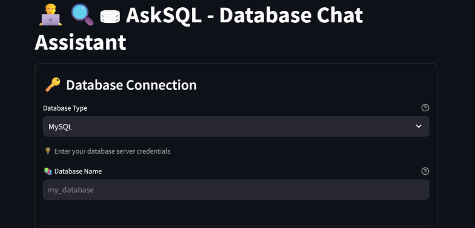
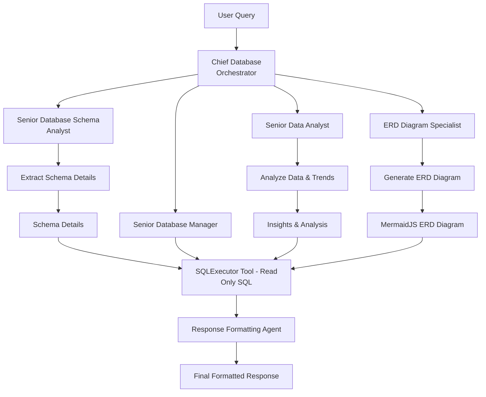
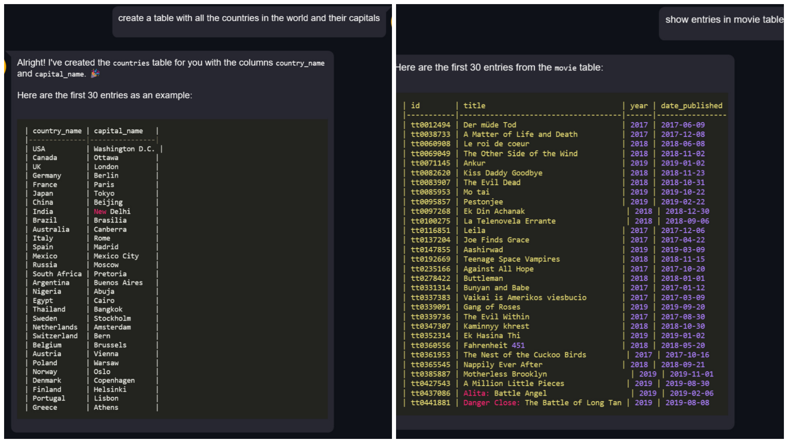
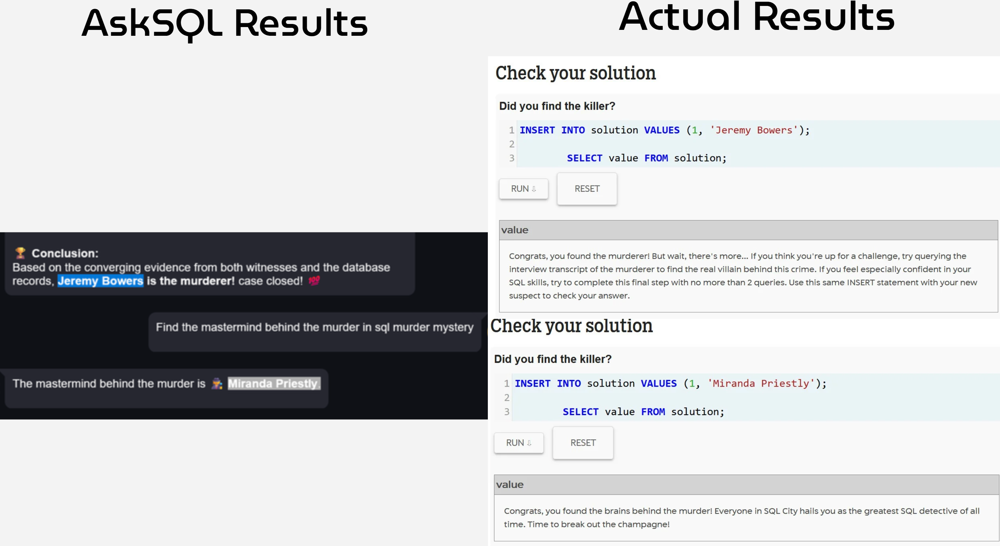
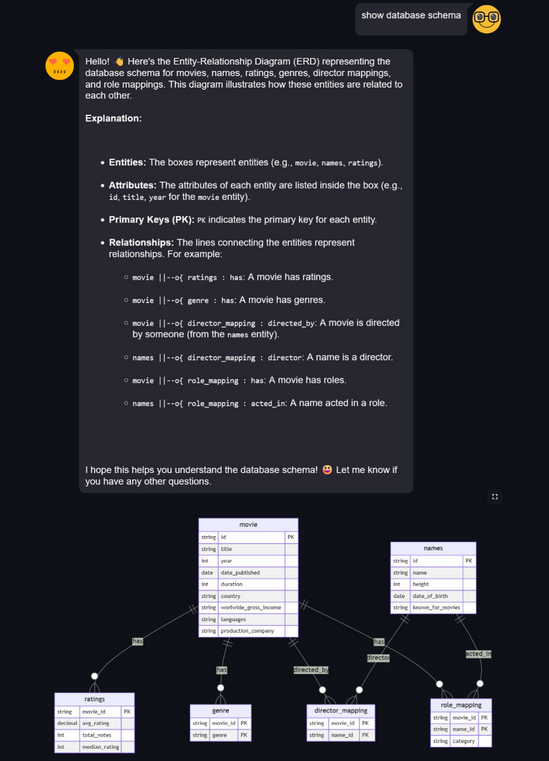

# AskSQL 🔍⛃  
**Analyze and Talk to Large Databases in Natural Language**

AskSQL is an intelligent natural language interface for interacting with large-scale relational databases. It enables users to perform CRUD operations, generate ER diagrams, and analyze trends or insights—all by simply asking questions in plain English. Powered by a multi-agent architecture and enhanced with LLM capabilities, AskSQL bridges the gap between raw database structures and intuitive human communication.



---

## 🧠 Agent Flow



---

## 🚀 Features

### 📄 Perform CRUD Operations  
**Database Used:** IMDb  


---

### 📊 Perform Data Analysis  
**Database Used:** [Mystery Database (KnightLab)](https://mystery.knightlab.com/)  


---

### 🧩 Generate ERD Diagram  
**Database Used:** IMDb  


---

## ⚙️ Installation

Clone the repository:

```bash
git clone https://github.com/0xMihirK/AskSQl
cd ./AskSQL
```

Install dependencies:

```bash
pip install -r requirements.txt
```

Set your Gemini API Key from [Google AI Studio](https://aistudio.google.com/) in the `.env` file:

```
GEMINI_API_KEY=your_api_key_here
```

Run the Streamlit app:

```bash
streamlit run ./app.py
```

---
